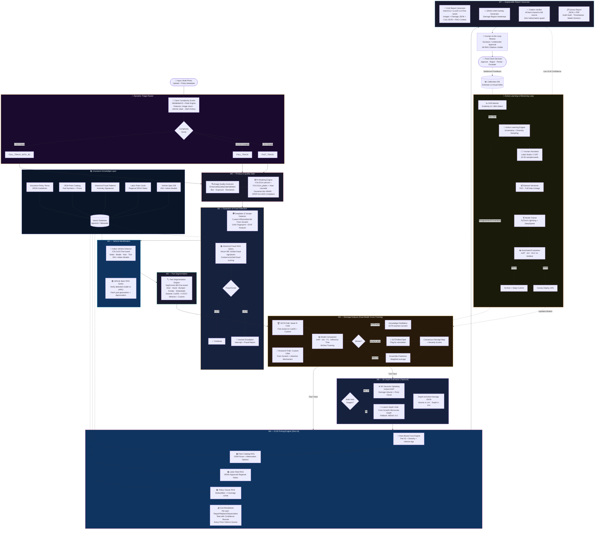

# AI Automated Insurance Survey Agent — Hybrid Pipeline Architecture

**Project:** AI Automated Insurance Survey Agent (TIH-IoT CHANAKYA Fellowship 2025)  
**Scope:** Modular ML tools / standalone models for integration into existing insurer systems  
**Architecture:** Custom Hybrid Pipeline — Best of 5 Paradigms  

---

## Design Philosophy

This hybrid pipeline combines the **strongest elements** from five distinct architectural paradigms into one cohesive, modular system:

| Element | Source Pipeline | What We Take |
|---------|---------------|--------------|
| **Sequential modular JSON I/O** | Pipeline 1 (Linear Chain) | Clean module interfaces, independent testability, REST API integration |
| **Dynamic routing & self-correction** | Pipeline 2 (LangGraph Agents) | Supervisor-based triage, retry loops, fraud escalation paths |
| **Knowledge-grounded decisions** | Pipeline 3 (RAG-Augmented) | Vector DB for policies, parts catalogs, historical fraud patterns |
| **Fast/Deep dual-track processing** | Pipeline 4 (Dual-Stream Triage) | Lightweight fast path for 80% of claims, heavy path for complex cases |
| **SOTA vs Scratch cross-training** | Pipeline 5 (Data Flywheel) | Dual-model benchmarking, knowledge distillation, active learning |

---

## Hybrid Pipeline — Full Architecture



---

## Module Specifications

### M0 — Privacy & Quality Gate

| Attribute | Detail |
|-----------|--------|
| **Purpose** | Filter low-quality images; mask PII for DPDP/IRDAI compliance |
| **Input** | Raw images (JPEG/PNG), `List[UploadFile]` — all images processed per request |
| **Output** | `{ quality_score, blur_score, exposure_score, passed, pii_found, faces_detected, plates_detected, faces_boxes, plates_boxes, redacted_image_b64 }` |
| **Models** | `EnhancedQualityGateValidator` (quality), YOLO11m class 0 conf=0.45 (person/face), YOLO11m_plates conf=0.3 + Haar cascade union (plates) |
| **Redaction** | Gaussian blur 99×99 on top 35% of person bbox (head) and full plate bbox |
| **Build Type** | Fine-tuned + Custom |
| **Status** | ✅ Implemented |
| **Track** | Both Fast and Deep |

### M1 — Forensics & Fraud Detection

| Attribute | Detail |
|-----------|--------|
| **Purpose** | Detect manipulated/deepfaked images; flag suspicious claims |
| **Input** | Sanitized images, EXIF metadata |
| **Output** | `{ fraud_score, fraud_type, exif_analysis, rag_similar_frauds[], escalation_required }` |
| **Models** | Custom EfficientNet-B4 (from scratch), EXIF analyzer, RAG fraud pattern retriever |
| **Build Type** | From Scratch (research model) |
| **Track** | Deep only (Fast Track skips this) |
| **Innovation** | RAG-grounded historical fraud comparison from Pipeline 3 |

### M2 — Vehicle Identification

| Attribute | Detail |
|-----------|--------|
| **Purpose** | Identify Indian vehicle make, model, year, trim level |
| **Input** | Sanitized images |
| **Output** | `{ make, model, year, trim, confidence, variant, body_type, policy_match_verified }` |
| **Models** | YOLOv10 fine-tuned (Deep), YOLOv10-Nano (Fast) |
| **Dataset** | Custom scraped: Maruti, Tata, Hyundai, Mahindra + CarDekho |
| **Build Type** | Fine-tuned SOTA |
| **Innovation** | RAG policy verification — detected vehicle cross-checked against policy DB |

### M3 — Part Segmentation

| Attribute | Detail |
|-----------|--------|
| **Purpose** | Segment individual car parts for damage localization |
| **Input** | Sanitized images, vehicle identification JSON |
| **Output** | `{ parts[]: { name, mask, bounding_box, confidence } }` |
| **Models** | SegFormer-B5 fine-tuned |
| **Dataset** | CarDD + COCO-Vehicles + Custom annotated (40+ part classes) |
| **Build Type** | Fine-tuned SOTA |
| **Track** | Deep only (Fast Track uses bounding boxes from M2) |

### M4 — Damage Analysis (Dual-Model with Cross-Training)

| Attribute | Detail |
|-----------|--------|
| **Purpose** | Detect and classify damage; benchmark SOTA vs from-scratch models |
| **Input** | Sanitized images, part segmentation masks |
| **Output** | `{ damages[]: { type, severity, mask, area_pct, confidence, model_source }, cross_training_metrics, consensus_method }` |
| **SOTA Model** | Mask R-CNN fine-tuned on CarDD + Custom |
| **Research Model** | Custom UNet + Attention (from scratch) |
| **Build Type** | Both (head-to-head benchmarking) |
| **Innovation** | Pipeline 5's cross-training flywheel — winner teaches loser via knowledge distillation |
| **Damage Classes** | Dent, Scratch, Crack, Shatter, Deformation, Paint Damage, Glass Damage |
| **Severity Levels** | Minor, Moderate, Severe, Totalled |

### M5 — 3D Depth Estimation (Optional)

| Attribute | Detail |
|-----------|--------|
| **Purpose** | Estimate damage depth/volume from multi-view or monocular images |
| **Input** | Sanitized images (3+ for NeRF, 1 for monocular) |
| **Output** | `{ depth_map, deformation_depth_mm, damage_volume_cm3, point_cloud_path }` |
| **Models** | Instant-NGP + 3D Gaussian Splatting (multi-view), Custom Depth UNet (monocular) |
| **Build Type** | Existing + Custom from scratch |
| **Track** | Deep only, triggered by triage router when multi-view available |

### M6 — ICVE Pricing Engine (Zero AI)

| Attribute | Detail |
|-----------|--------|
| **Purpose** | Calculate repair/replace costs using rule-based engine with RAG-grounded data |
| **Input** | Damage JSON, vehicle info, part IDs |
| **Output** | `{ line_items[]: { part, damage_type, repair_cost, replace_cost, depreciation, source_citation }, total, confidence_bounds }` |
| **Engine** | Pure rule-based — NO AI in pricing path |
| **Data Sources** | RAG: OEM parts catalog, IRDAI labor rates, policy clauses, depreciation tables |
| **Build Type** | Custom built |
| **Innovation** | Pipeline 3's RAG citations — every price traceable to source document |

### M7 — Explainable Report Generator

| Attribute | Detail |
|-----------|--------|
| **Purpose** | Generate human-readable survey report with XAI overlays |
| **Input** | All prior module outputs + original images |
| **Output** | `{ report_pdf, report_json, grad_cam_overlays[], audit_hash, citations[] }` |
| **Models** | InternVL2 / LLaVA-1.6 fine-tuned VLM |
| **Build Type** | Fine-tuned VLM |
| **Innovation** | Citation verifier ensures every fact is RAG-grounded; GRAD-CAM damage heatmaps |

---

## Cross-Cutting Architecture Components

### Triage Router (from Pipeline 4)

Routes claims into **Fast Track** or **Full Track** based on complexity:

| Track | Latency | Modules Used | Coverage |
|-------|---------|-------------|----------|
| **Fast** | < 5 sec | M0 → M2 (Nano) → M4 (lightweight) → M6 (simplified) → M7 (template) | ~80% claims |
| **Full** | 30-120 sec | M0 → M1 → M2 → M3 → M4 (dual-model) → M5 (optional) → M6 (full RAG) → M7 (VLM) | ~20% claims |

**Arbitration**: When both tracks run, outputs are compared. If estimates differ by >15%, the Deep output is used.

### RAG Knowledge Layer (from Pipeline 3)

A shared vector database (pgvector) powering multiple modules:
- **M1** queries historical fraud patterns
- **M2** verifies vehicle against policy records  
- **M6** retrieves OEM prices, labor rates, policy clauses
- **M7** grounds every report fact in cited sources

### Cross-Training Engine (from Pipeline 5)

The core research contribution:
1. **Dual inference** — SOTA and from-scratch models run on every batch
2. **Metric comparison** — mAP, IoU, F1 tracked in MLflow
3. **Knowledge distillation** — Winner's predictions become soft labels for the loser
4. **Active learning** — Uncertain samples flagged for human annotation (20-50/week)
5. **Drift monitoring** — Evidently AI detects systematic model degradation

### Calibration Feedback Loop

Post-settlement data flows back:
1. Actual settlement amount vs AI estimate stored in calibration DB
2. Drift monitor detects systematic bias (regional, vehicle-type, damage-type)
3. Bias alerts trigger targeted active learning

---

## Technology Stack

### Core Vision Models
| Model | Architecture | Build Type | Purpose |
|-------|-------------|-----------|---------|
| YOLO11m | YOLO family | Pre-trained | Person/face detection (M0) |
| YOLO11m_plates | YOLO family | Fine-tuned | License plate detection (M0) |
| YOLOv8n | YOLO family | Fine-tuned SOTA | Vehicle detection (M2) |
| SegFormer-B5 | Transformer segmentation | Fine-tuned SOTA | Part segmentation (M3) |
| Mask R-CNN | Instance segmentation | Fine-tuned SOTA | Damage detection — SOTA path (M4) |
| Custom UNet + Attention | UNet variant | From Scratch | Damage detection — research path (M4) |
| Custom EfficientNet-B4 | EfficientNet | From Scratch | Fraud/forensics (M1) |
| Custom Depth UNet | UNet variant | From Scratch | Monocular depth estimation (M5) |
| Instant-NGP + 3DGS | Neural radiance fields | Existing | 3D reconstruction (M5) |

### Language & Multimodal Models
- **VLM**: InternVL2-26B / LLaVA-1.6-34B (report generation)
- **Embeddings**: BAAI/bge-large-en-v1.5 / E5-large-v2 (RAG embeddings)

### Infrastructure
- **Backend**: FastAPI + Celery + Redis
- **Vector DB**: pgvector (PostgreSQL extension)
- **Experiment Tracking**: MLflow / Weights & Biases
- **Data Versioning**: DVC
- **Active Learning**: ModAL + Label Studio
- **Drift Detection**: Evidently AI
- **Model Serving**: BentoML / FastAPI + Docker
- **Training**: PyTorch Lightning + DeepSpeed

### Datasets
- **Vehicle**: Custom Indian vehicles (CarDekho scraped + manual annotation)
- **Damage**: CarDD + COCO-Vehicles + Custom annotated
- **Fraud**: FaceForensics++ + DEFACTO + Custom insurance fraud
- **Parts/Pricing**: IRDAI-compliant OEM catalog + regional labor rates
- **3D**: ShapeNet (pretrain) + custom multi-view insurance images

---

## Module Interface Contract

Every module exposes a standard REST API:

```
POST /api/modules/{module_id}/process
Content-Type: multipart/form-data

Request:
  files: List[UploadFile]   # one or more images

Response (single image):
{
  "module_id": "M0",
  "filename": "image.jpg",
  "processing_time_ms": 120,
  "output": { /* module-specific structured JSON */ }
}

Response (multiple images): array of the above objects
```

---

## Data Flow Summary

```
Input Images → Triage Router → [Fast/Full Track Selection]
                                    │
         ┌──────────────────────────┴──────────────────────────┐
         │ FAST TRACK                                          │ FULL TRACK
         │ M0 → M2(Nano) → M4(light) → M6(simple) → M7(tmpl) │ M0 → M1 → M2 → M3 → M4(dual) → M5? → M6(RAG) → M7(VLM)
         └──────────────────────────┬──────────────────────────┘
                                    │
                        Arbitration (if both ran)
                                    │
                         Human-in-the-Loop Review
                                    │
                            Claim Decision
                                    │
                    Settlement Feedback → Calibration DB → Drift Monitor
```

---

## Comparison: Hybrid vs Individual Pipelines

| Criterion | Hybrid Pipeline | Best Individual |
|-----------|----------------|-----------------|
| Integration simplicity | ⭐⭐⭐⭐ | Pipeline 1 (⭐⭐⭐⭐⭐) |
| Research novelty | ⭐⭐⭐⭐⭐ | Pipeline 5 (⭐⭐⭐⭐⭐) |
| Explainability | ⭐⭐⭐⭐⭐ | Pipeline 3 (⭐⭐⭐⭐⭐) |
| Speed | ⭐⭐⭐⭐ | Pipeline 4 (⭐⭐⭐⭐⭐) |
| Scalability | ⭐⭐⭐⭐ | Pipeline 4 (⭐⭐⭐⭐⭐) |
| Regulatory compliance | ⭐⭐⭐⭐⭐ | Pipeline 3 (⭐⭐⭐⭐⭐) |
| Model improvement | ⭐⭐⭐⭐⭐ | Pipeline 5 (⭐⭐⭐⭐⭐) |
| 10-month feasibility | ⭐⭐⭐⭐ | Pipeline 1 (⭐⭐⭐⭐⭐) |
