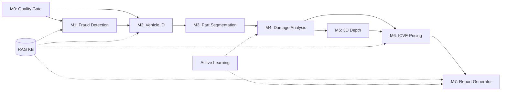

# AI Insurance Survey Agent — Design Plan

## Module Interface Contracts & Implementation Guide

---

## Project Structure (Target)

```
ai-insurance-survey-agent/
├── ARCHITECTURE.md              # Hybrid pipeline architecture
├── DESIGN_PLAN.md               # This file — module specs & interfaces
├── README.md                    # Project overview & setup
├── WEEKLY_GOALS.md              # 40-week task breakdown
├── MONTHLY_GOALS.md             # 10-month milestone plan
├── .gitignore
│
├── backend/                     # FastAPI backend + ML modules
│   ├── app/
│   │   ├── main.py             # FastAPI entry point
│   │   ├── config.py           # Configuration management
│   │   ├── api/                # REST API endpoints
│   │   │   ├── modules.py      # Module testing endpoints
│   │   │   ├── pipeline.py     # Full pipeline execution
│   │   │   └── health.py       # Health checks
│   │   ├── modules/            # Pipeline modules (M0-M7)
│   │   │   ├── m0_quality_gate/
│   │   │   │   ├── __init__.py
│   │   │   │   ├── quality_assessor.py
│   │   │   │   └── pii_masker.py
│   │   │   ├── m1_fraud_detection/
│   │   │   │   ├── __init__.py
│   │   │   │   ├── deepfake_detector.py
│   │   │   │   └── exif_analyzer.py
│   │   │   ├── m2_vehicle_identification/
│   │   │   │   ├── __init__.py
│   │   │   │   └── vehicle_detector.py
│   │   │   ├── m3_part_segmentation/
│   │   │   │   ├── __init__.py
│   │   │   │   └── part_segmenter.py
│   │   │   ├── m4_damage_analysis/
│   │   │   │   ├── __init__.py
│   │   │   │   ├── mask_rcnn_detector.py
│   │   │   │   ├── custom_unet_detector.py
│   │   │   │   └── cross_trainer.py
│   │   │   ├── m5_depth_estimation/
│   │   │   │   ├── __init__.py
│   │   │   │   ├── nerf_reconstructor.py
│   │   │   │   └── monocular_depth.py
│   │   │   ├── m6_icve_pricing/
│   │   │   │   ├── __init__.py
│   │   │   │   └── cost_engine.py
│   │   │   └── m7_report_generator/
│   │   │       ├── __init__.py
│   │   │       ├── vlm_reporter.py
│   │   │       └── grad_cam.py
│   │   ├── services/           # Shared services
│   │   │   ├── rag_service.py  # RAG knowledge layer
│   │   │   ├── triage.py       # Fast/Deep track router
│   │   │   └── storage.py      # File storage
│   │   └── core/               # Core utilities
│   │       ├── base_module.py  # Abstract base class for all modules
│   │       ├── schemas.py      # Shared Pydantic schemas
│   │       └── database.py     # Database setup
│   ├── models/                  # Downloaded model weights (gitignored)
│   ├── datasets/                # Training datasets (gitignored)
│   ├── requirements.txt
│   └── Dockerfile
│
├── frontend/                    # Module Testing Dashboard (Vite + React)
│   ├── src/
│   │   ├── App.tsx
│   │   ├── main.tsx
│   │   ├── components/
│   │   │   ├── ModuleTestPanel.tsx
│   │   │   ├── PipelineTestMode.tsx
│   │   │   ├── BenchmarkView.tsx
│   │   │   ├── ResultsViewer.tsx
│   │   │   └── ImageUploader.tsx
│   │   └── styles/
│   │       └── index.css
│   ├── package.json
│   └── vite.config.ts
│
├── notebooks/                   # Jupyter notebooks for research
├── scripts/                     # Training & evaluation scripts
└── configs/                     # Model & pipeline configurations
```

---

## Base Module Interface

Every pipeline module implements this abstract interface:

```python
from abc import ABC, abstractmethod
from pydantic import BaseModel
from typing import Any, Dict, List, Optional

class ModuleInput(BaseModel):
    claim_id: str
    images: List[str]           # File paths or base64
    context: Dict[str, Any]     # Outputs from prior modules
    config: Dict[str, Any]      # Track, RAG toggle, etc.

class ModuleOutput(BaseModel):
    module_id: str              # "M0" through "M7"
    status: str                 # "success", "error", "escalation"
    output: Dict[str, Any]      # Module-specific structured data
    metrics: Dict[str, float]   # inference_time_ms, confidence, etc.
    audit: Dict[str, str]       # model_version, timestamp, hash

class BaseModule(ABC):
    @abstractmethod
    def process(self, input: ModuleInput) -> ModuleOutput:
        """Process input through this module."""
        pass

    @abstractmethod
    def health_check(self) -> bool:
        """Return True if module is ready."""
        pass

    @abstractmethod
    def get_info(self) -> Dict[str, Any]:
        """Return module metadata (name, version, models used)."""
        pass
```

---

## Module I/O Schemas

### M0 → M1 (Privacy → Fraud)
```json
{
  "quality_score": 0.92,
  "blur_score": 0.15,
  "exposure_score": 0.88,
  "resolution": [1920, 1080],
  "pii_masked": true,
  "faces_detected": 2,
  "plates_detected": 1,
  "sanitized_image_paths": ["path/to/masked_img1.jpg"]
}
```

### M1 → M2 (Fraud → Vehicle ID)
```json
{
  "fraud_score": 0.12,
  "fraud_type": "none",
  "exif_valid": true,
  "exif_anomalies": [],
  "rag_similar_frauds": [],
  "escalation_required": false
}
```

### M2 → M3 (Vehicle ID → Part Segmentation)
```json
{
  "make": "Maruti Suzuki",
  "model": "Baleno",
  "year": 2022,
  "trim": "Zeta",
  "body_type": "hatchback",
  "segment": "premium_hatchback",
  "confidence": 0.94,
  "policy_match_verified": true
}
```

### M3 → M4 (Part Segmentation → Damage Analysis)
```json
{
  "parts": [
    {
      "name": "front_bumper",
      "mask_path": "path/to/mask.png",
      "bounding_box": [100, 200, 400, 350],
      "confidence": 0.91
    }
  ]
}
```

### M4 → M5/M6 (Damage → Depth/Pricing)
```json
{
  "damages": [
    {
      "type": "dent",
      "severity": "moderate",
      "part": "front_bumper",
      "mask_path": "path/to/dmg_mask.png",
      "area_percentage": 12.5,
      "confidence": 0.87,
      "model_source": "ensemble",
      "sota_confidence": 0.89,
      "scratch_confidence": 0.85
    }
  ],
  "cross_training_metrics": {
    "sota_map": 0.72,
    "scratch_map": 0.68,
    "consensus_method": "ensemble"
  }
}
```

### M6 → M7 (Pricing → Report)
```json
{
  "line_items": [
    {
      "part": "front_bumper",
      "damage_type": "dent",
      "repair_cost": 4500,
      "replace_cost": 12000,
      "recommended": "repair",
      "depreciation_pct": 15,
      "final_cost": 3825,
      "source_citation": "OEM Catalog #MB-2022-FB-001"
    }
  ],
  "total_estimate": 3825,
  "confidence_bounds": [3200, 4400],
  "currency": "INR"
}
```

---

## Configuration Management

```yaml
# configs/pipeline.yaml
pipeline:
  default_track: "full"         # "fast" or "full"
  enable_rag: true
  enable_3d: false              # Enable M5 only when multi-view available
  enable_cross_training: true
  fraud_threshold: 0.75
  arbitration_delta: 0.15       # 15% cost estimate delta triggers deep track

modules:
  m0:
    blur_threshold: 0.3
    min_resolution: [640, 480]
    pii_confidence_threshold: 0.5
  m1:
    fraud_model: "efficientnet_b4_v1"
    exif_check: true
    rag_fraud_top_k: 5
  m2:
    fast_model: "yolov10n_indian_v1"
    full_model: "yolov10l_indian_v1"
    confidence_threshold: 0.7
  m3:
    model: "segformer_b5_parts_v1"
    num_classes: 40
  m4:
    sota_model: "maskrcnn_cardd_v1"
    scratch_model: "custom_unet_attn_v1"
    distillation_temperature: 3.0
    agreement_iou_threshold: 0.8
  m5:
    nerf_model: "instant_ngp"
    mono_model: "custom_depth_unet_v1"
    min_views_for_nerf: 3
  m6:
    parts_catalog_version: "2025_q1"
    labor_rates_region: "all_india"
    depreciation_table: "irdai_2024"
  m7:
    vlm_model: "internvl2_26b"
    enable_grad_cam: true
    citation_verification: true

rag:
  vector_db: "pgvector"
  embedding_model: "bge-large-en-v1.5"
  collections:
    - "insurance_policies"
    - "oem_parts_catalog"
    - "fraud_patterns"
    - "labor_rates"
    - "vehicle_specs"

mlops:
  experiment_tracker: "mlflow"
  data_versioning: "dvc"
  drift_detection: "evidently"
  active_learning_batch_size: 50
  canary_traffic_pct: 10
```

---

## Dependency Graph



**Fast Track shortcut**: M0 → M2(Nano) → M4(lightweight) → M6(simplified) → M7(template)

---

## API Endpoints (Backend)

| Method | Endpoint | Purpose |
|--------|----------|---------|
| `GET` | `/api/health` | System health + module status |
| `GET` | `/api/modules` | List all available modules |
| `GET` | `/api/modules/{id}` | Module info + health |
| `POST` | `/api/modules/{id}/process` | Run single module |
| `POST` | `/api/pipeline/run` | Run full/partial pipeline |
| `POST` | `/api/pipeline/benchmark` | Run SOTA vs Scratch benchmark |
| `GET` | `/api/pipeline/results/{id}` | Get pipeline run results |
